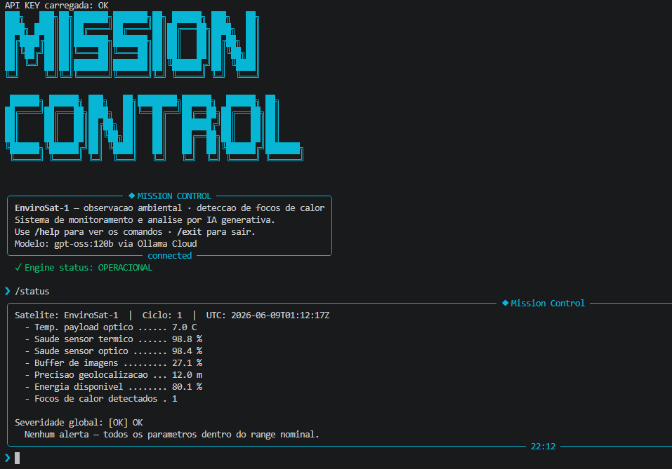
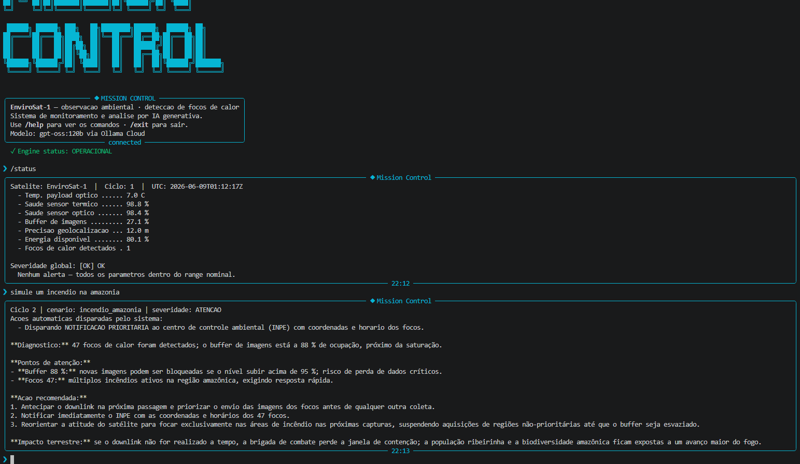

# Mission Control AI — EnviroSat-1

Sistema de monitoramento operacional de um satelite ambiental simulado. Recebe
telemetria do EnviroSat-1, detecta anomalias via logica Python e usa IA
generativa (Ollama Cloud · gpt-oss:120b) para analisar o estado da missao em
linguagem natural, sempre amarrando cada alerta ao seu **impacto terrestre**:
combate ao desmatamento e resposta rapida a incendios.

> Trilha escolhida: **EnviroSat (Observacao Ambiental)** — FIAP · Global Solution 2026.1

---

## Integrantes

- Gustavo Henrique Pereira Correia — RM: 569921
- Matheus Caviglia Ferreira — RM: 569638

Modalidade: Dupla

---

## O que o projeto faz

O sistema simula a operacao de um satelite de observacao ambiental (classe
Amazonia-1 / Landsat). A cada ciclo ele gera telemetria de 7 parametros, uma
camada de regras em Python classifica a severidade (OK / ATENCAO / CRITICO) e
dispara respostas automatizadas, e o modelo `gpt-oss:120b` recebe **os dados
reais injetados dinamicamente** para produzir um diagnostico contextualizado. A
IA explica e contextualiza; quem decide "e critico ou nao" e o codigo.

## Persona atendida

Operador de centro de controle ambiental (INPE), com suporte a coordenador de
brigada de incendio e analista de compliance. A persona e definida no
`prompts/system_prompt.md` e mantida coerente em todas as respostas — o tom e de
sala de controle: direto, tecnico e calmo, com urgencia proporcional a severidade.

## Tecnologias utilizadas

- Python 3.10+
- Ollama Cloud API (modelo `gpt-oss:120b`)
- Bibliotecas: `ollama`, `python-dotenv`, `rich`, `prompt_toolkit`, `pyfiglet`

## Como executar

1. Clone o repositorio:
   ```bash
   git clone https://github.com/usuario/mission-control-ai.git
   cd mission-control-ai
   ```
2. Crie o ambiente virtual e ative:
   ```bash
   python -m venv .venv && source .venv/bin/activate   # Windows: .venv\Scripts\activate
   ```
3. Instale as dependencias:
   ```bash
   pip install -r requirements.txt
   ```
4. Crie o arquivo `.env` na raiz (use `.env.example` como modelo):
   ```env
   OLLAMA_API_KEY=sua_chave_aqui
   ```
5. Execute:
   ```bash
   python main.py
   ```

Comandos da CLI: `/help`, `/status`, `/about`, `/clear`, `/exit`. Voce tambem
pode forcar cenarios de teste na propria pergunta — ex.: *"simule um incendio"*,
*"e a bateria?"*, *"tem problema de geolocalizacao?"*.

## Demonstracao




## System Prompt

O system prompt completo esta em [`prompts/system_prompt.md`](prompts/system_prompt.md).
Ele define papel + escopo + restricoes + tom + formato de saida e inclui
exemplos few-shot. O ponto central: para cada anomalia, a IA e obrigada a
explicar **quem sofre na Terra** se o problema nao for resolvido.

### Iteracoes do prompt (processo)
- **v1** — generico ("analise os dados"): a IA inventava parametros que nao
  existiam e ignorava a severidade ja calculada.
- **v2** — adicionamos restricao "use apenas os numeros fornecidos" e o formato
  de saida fixo: respostas ficaram consistentes, mas longas demais.
- **v3** — incluimos 2 exemplos few-shot e o limite de ~10 linhas: respostas
  passaram a seguir o padrao Diagnostico → Atencao → Acao → Impacto terrestre.

## Diferenciais implementados

- **Few-shot prompting** — dois exemplos no system prompt guiam o formato.
- **Memoria de contexto** — os ultimos 5 ciclos sao passados a IA (consciencia
  temporal), permitindo notar tendencias.
- **Saida estruturada na logica** — `alertas.avaliar()` devolve um dict com
  severidade, alertas e acoes automaticas, consumido pela UI e pelo prompt.
- **Interface visual** — CLI com Rich (paineis, tabelas, spinner) + banner ASCII.

## Cenarios de teste demonstrados

1. **Operacao normal** — todos os parametros no range, severidade OK.
2. **Incendio na Amazonia** — 47 focos + buffer 88%, priorizacao de downlink.
3. **Bateria critica** — energia 14%, modo economia ativado automaticamente.
4. **Falha do sensor termico** — deteccoes marcadas como baixa confianca.
5. **Perda de geolocalizacao** — focos detectados com coordenada nao confiavel.

(Definidos em [`data/cenarios.json`](data/cenarios.json).)

## Limitacoes conhecidas

- A telemetria e simulada (drift + ruido aleatorio), nao reflete fisica orbital real.
- O modelo e nao-deterministico; mesmo com `temperature` baixa, ha variacao entre
  execucoes. Rodamos cada cenario 3x para validar consistencia.
- Sem persistencia em disco: o historico vive so durante a sessao.
- A geolocalizacao nao usa coordenadas reais — apenas o erro em metros.

---

## Proposta de valor / modelo de negocio

**1. Qual o problema real terrestre que esta missao resolve?**
Incendios e desmatamento na Amazonia e no Cerrado sao detectados tarde demais.
Cada hora entre o inicio de um foco e o despacho da brigada aumenta a area
queimada exponencialmente. O EnviroSat encurta esse intervalo levando deteccao
termica geolocalizada ao centro de controle quase em tempo real.

**2. Quem paga pela solucao?**
Modelo hibrido. O nucleo e **publico**: INPE/IBAMA e secretarias estaduais de
meio ambiente financiam a operacao como infraestrutura de fiscalizacao (linha ja
existente em DETER/PRODES). Uma camada **privada** complementa: seguradoras
rurais, certificadoras de credito de carbono e tradings de commodities pagam por
relatorios de compliance ambiental e verificacao de areas protegidas.

**3. Metrica de impacto (se o satelite operar 100% saudavel por 1 ano)**
Cobertura de aproximadamente **2,5 milhoes de hectares de floresta monitorados
por revisita diaria**, com reducao estimada de **3 a 6 horas no tempo medio de
deteccao de focos** — o suficiente para conter incendios ainda em estagio
inicial e evitar a emissao de centenas de milhares de toneladas de CO₂ por
temporada de seca.

**4. Modelo de negocio**
**Dado-como-servico (DaaS)** com dois fluxos: (a) concessao publica por contrato
plurianual com orgaos ambientais (alertas de foco como servico essencial); e (b)
**assinatura B2B** para seguradoras e certificadoras consumirem relatorios de
compliance via API. O custo marginal de mais um cliente e baixo — o mesmo dado
orbital serve a varios assinantes.

---

## Video de demonstracao

[Assistir demonstracao no YouTube](https://youtu.be/iamewdJ6KmY)
